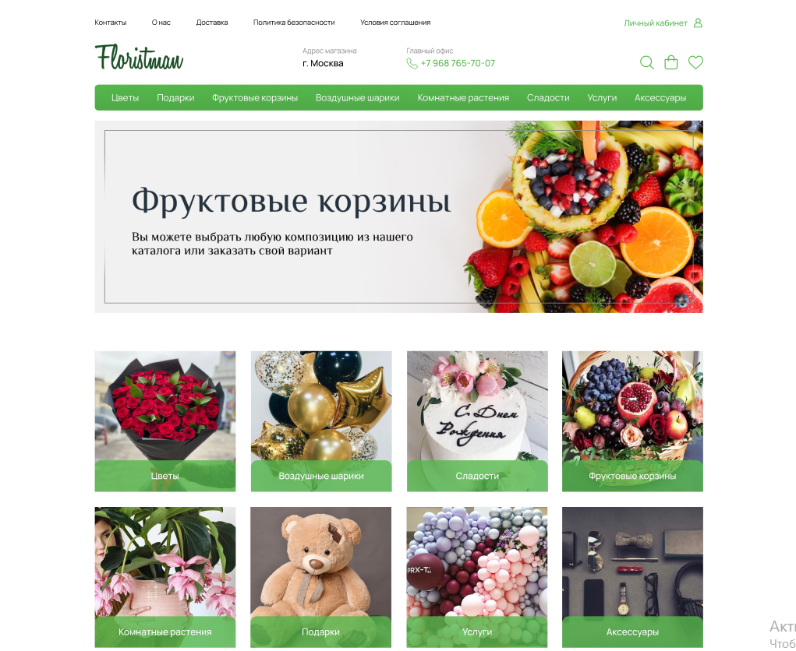

## Макет сайта с Figma

### Технологии:
1. html
2. css
3. Java script
4. Node JS + Express 
5. MySQL  
   
### Ссылка на макет:
https://www.figma.com/file/Nkl3IWYhmkTQhPyanZ5g4J/Floristman?node-id=0%3A1  

### Описание:
Простой проект небольшого интернет магазина. Из интересного: форма авторазации с возможностью ввести логин и пароль. После этого можно положить товары в корзину. Также есть возможность зарегистрироваться.  

Данные о пользователях хрнятся в базе данных.

